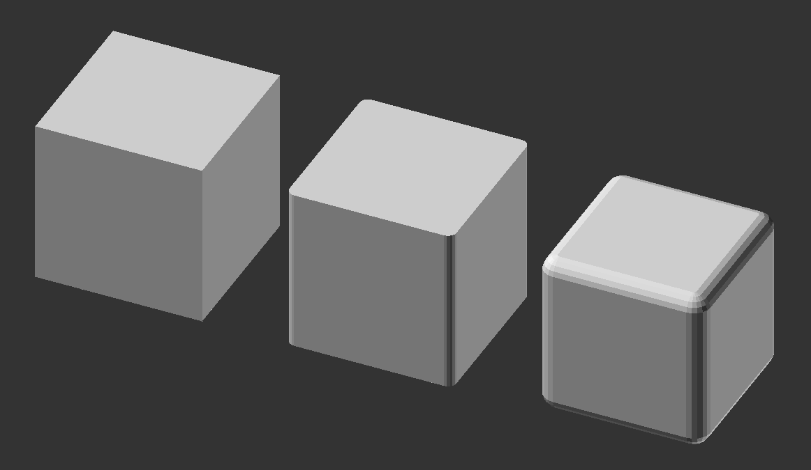

# Cubes with rounded corners for openSCAD

## Features

* Drop-in replacement for `cube()` function
* Design/prototype with cube() for fast preview and just replace it where needed. 
* Optionally, specify a rounding radius for each cube. Default is 5% of
  smallest dimension 
* Skip rounding of top and bottom faces with `flat_tops` module
* `cube(x)` works with both `x` as a number and a vector
* Use `$fn=4` for chamfered edges - works great with `flat_tops`, but will cause some shrinking in `z` for `round_cube`.  

## Usage

* Copy the `rounded_cubes.scad` file, and add `use <path/rounded_cubes.scad>`
  before calling any of the modules.

## Example

```openscad
use <round_cube.scad>

cube([10, 10, 10], $fn=20);
translate([15, 0, 0])
flat_tops([10, 10, 10], $fn=20);
translate([30, 0, 0])
round_cube([10, 10, 10], radius=1, $fn=20);
```

This results in the following output:



## Known issues

* When the radius is greater than half the minimum dimension of the cubes,
  silently defaults to 5% of the radius.
* `$fn` value less than 10 can cause noticeable dimensional issues in `round_cube()` 
